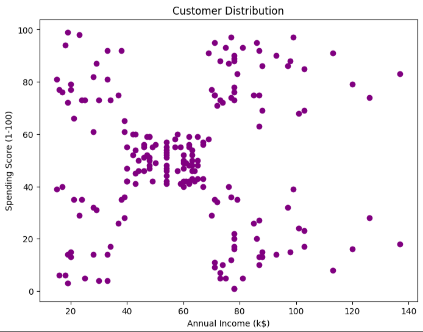
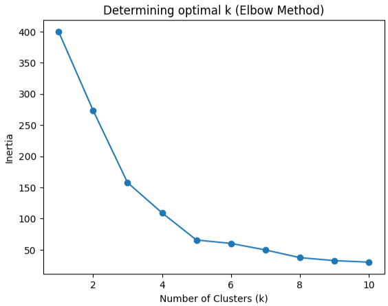
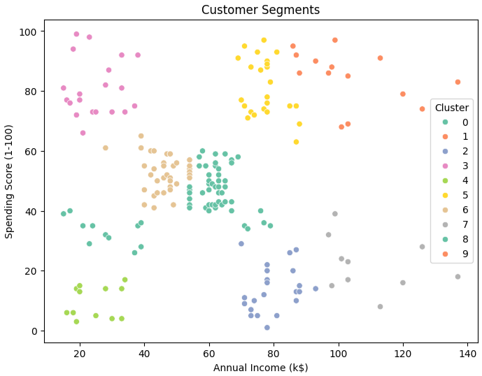
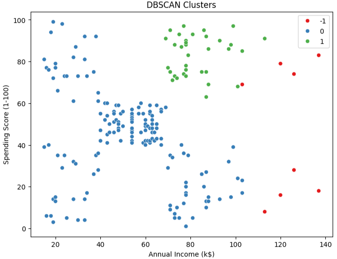

# 🛍️ Customer Segmentation using K-Means Clustering

This project focuses on segmenting mall customers into groups based on their **Annual Income** and **Spending Score**.  
The goal is to help businesses understand customer behavior and design targeted marketing strategies.

# 📂 Dataset
- Source: https://www.kaggle.com/datasets/vjchoudhary7/customer-segmentation-tutorial-in-python
- Dataset name: Mall_Customers.csv  
- Columns in dataset:
  - `CustomerID`: Unique ID for each customer
  - `Gender`: Male/Female
  - `Age`: Age of customer
  - `Annual Income (k$)`: Annual income in thousands
  - `Spending Score (1–100)`: Score assigned based on customer spending behavior

👉 For clustering, only **Annual Income** and **Spending Score** were used.

# ⚙️ Tools & Libraries
- **Python**
- **pandas** → Data loading and processing  
- **matplotlib & seaborn** → Data visualization  
- **scikit-learn**
  - `StandardScaler` → Scaling features
  - `KMeans` → Clustering algorithm
 
# 📊 Visualizations

# 🔹 Customer Distribution (Before Clustering)

# 🔹 Elbow Method

# 🔹 Final Customer Segments

# 📌 Results & Insights
Based on the clustering results, here’s how the customer groups look:

----------------------------------------------------------------------
| Cluster | Income 💰    | Spending 💸  | Description                |
|---------|--------------|--------------|-----------------------------|
| 0       | Average      | Average      | Balanced group             |
| 1       | High         | Very High    | Premium customers 💎      |
| 2       | High         | Very Low     | Wealthy but conservative   |
| 3       | Low          | High         | Enthusiastic Shoppers 🛍️  |
| 4       | Low          | Very Low     | Budget Customers 💰        |
| 5       | Upper Middle | High         | Potential Loyalists        |
| 6       | Lower Middle | Medium       | Casual Customers           |
| 7       | Very High    | Low          | Luxury but less engaged    |
| 8       | Very Low     | low          | Struggling Customers       |
| 9       | Very High    | Very High    | VIP Customers 👑          |
---------------------------------------------------------------------

👉 These segments help businesses design:
- Targeted marketing campaigns
- Personalized offers
- Customer retention strategies

# 🎁 Bonus: DBSCAN clustering algorithm

